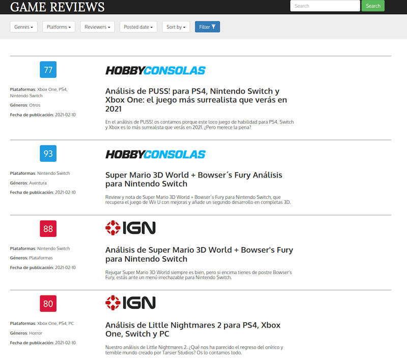

+++
author = "David Gallardo"
title = "Building a website to display the scraped data"
date = "2021-02-16"
tags = [
    "python",
    "flask",
    "mongodb",
    "javascript"
]
categories = [
    "web development",
    "games reviews"
]
series = ["Web Scraping"]
aliases = ["migrate-from-jekyl"]
image = "flask_logo.svg"
+++

## Project Description

Last time, we implemented a web scraper to extract game reviews and store them in a MongoDB collection. Although the last project was valuable on its own, it would be nice to extend it so that we can also explore the data we have collected. One solution is to create a website that allows us to make queries to the MongoDB collection and display the results.

There are a number of full-featured web frameworks available in Python (Django, Pyramid, Web2py, etc ), but as our website will be a simple one, a lightweight framework like Flask will suffice. As for the interaction with MongoDB, we are already familiar with pymongo, as we used it before to store the scraped data into the collection, so we will use it again. Finally, in the front-end, we will make use of AJAX to implement some sort of pagination on the results without having to reload the page.

Before we get to work, I will show you a screenshot of the final webpage for you to get an idea of the intended result :



As you can see our website allows to make the following queries:

* Filter reviews by genre, platform, reviewer and posted date.
* Search reviews by game name.
* Sort the displayed results either by score or posted date.

## MongoDB queries

There will be two types of queries in our application: 1) search by name queries; and 2) filter queries. The latter ones have two types of conditions: equality conditions (using the $and operator if more than one condition on the same field) and range conditions (using $gt and/or $lt). Also in the latter case, it is possible to sort the results either by posted date or score of the review.

``` python3

def _process_result(result):
    result["genre"] = ", ".join(result["genre"])
    result["platforms"] = ", ".join(result["platforms"])
    result["release_date"] = str(result["release_date"]).split(' ')[0]
    result["score"] = int(result["score"])
    return result


def list_reviews(collection, filter_dict, sort_by="release_date", offset=0, page_size=1):
    cursor = collection.find(filter_dict).sort(sort_by, pymongo.DESCENDING)
    if offset > 0:
        cursor = cursor.skip(offset)
    cursor = cursor.limit(page_size+1)
    results = [_process_result(result) for result in cursor]
    has_next = len(results) > page_size
    if has_next:
        return results[:-1], has_next
    return results, has_next


def search_by_name(collection, name, max_number_results=5):
    query = {"game_name":{"$regex": name, "$options": 'i'}}
    cursor = collection.find(query).limit(max_number_results)
    return [_process_result(result) for result in cursor]


def build_query(eq_filters, range_filters):
    filter_dict = {}

    and_cond = []
    for field, eq_conds in eq_filters.items():
        if len(eq_conds) == 1:
            filter_dict[field] = eq_conds[0]
        else:
            and_cond += [{field:value} for value in eq_conds]
    if and_cond:
        filter_dict["$and"] = and_cond
    
    for range_field, (inf_limit, sup_limit) in range_filters.items():
        _range_filter = {range_field: {}}
        if inf_limit:
            _range_filter[range_field]["$gt"] = inf_limit
        if sup_limit:
            _range_filter[range_field]["$lt"] = sup_limit
        if _range_filter[range_field]:
            filter_dict.update(_range_filter)
    return filter_dict
```

Note that we request page_size+1 elements in `list_reviews()` so that we can check if there are more than PAGE_SIZE matches. This will be useful later on, when we implement the pagination of results.

## Flask Routing and Jinja Templates

There will be only two URLs (or routes) in our application: 1) “/index” (or just “/”) used by the end user to access the webpage in the browser; and 2) “/list” used by the JavaScript code to request  results by means of AJAX. 

The view function associated with the first route is really simple as it just renders a Jinja Template. This template is what actually does all the heavy lifting here, so we will focus on it.

``` html


<div class="dropdown pull-left">
  <button class="btn btn-default dropdown-toggle" type="button" id="dropdownMenu1" data-toggle="dropdown"
    aria-haspopup="true" aria-expanded="true" name="{{opts_type}}">
    {{opts_name}}
    <span class="caret"></span>
  </button>
  <ul class="dropdown-menu checkbox-menu allow-focus" aria-labelledby="dropdownMenu1">
    
    <li>
      <label>
        <input type="{{type}}" autocomplete="off" name="{{value}}"> {{value}}
      </label>
    </li>
    
  </ul>
</div>



<html>

<head>
  <title>Game Reviews</title>
  <meta charset="utf-8">
  <meta http-equiv="X-UA-Compatible" content="IE=edge">
  <meta name="viewport" content="width=device-width, initial-scale=1">
  <link rel="stylesheet" href="{{ url_for('static', filename='css/bootstrap.min.css') }}">
  <link rel="stylesheet" href="{{ url_for('static', filename='css/styles.css') }}">
  <link href='https://fonts.googleapis.com/css?family=Oxygen:400,300,700' rel='stylesheet' type='text/css'>
  <link href='https://fonts.googleapis.com/css?family=Lora' rel='stylesheet' type='text/css'>
  <script>
    const request_params = {{ request.args| tojson | safe}};
    const request_url = "{{ url_for('list_reviews') }}";
  </script>
  <script src="{{ url_for('static', filename='js/ajax-utils.js') }}"></script>
  <script src="{{ url_for('static', filename='js/jquery-2.1.4.min.js') }}"></script>
  <script src="{{ url_for('static', filename='js/bootstrap.min.js') }}"></script>
  <script src="{{ url_for('static', filename='js/script.js') }}"></script>

</head>

<body>

  <nav class="navbar navbar-inverse">
    <div class="container">
      <div class="navbar-header">
        <button type="button" class="navbar-toggle collapsed" data-toggle="collapse" data-target="#navbar"
          aria-expanded="false" aria-controls="navbar">
          <span class="sr-only">Toggle navigation</span>
          <span class="icon-bar"></span>
          <span class="icon-bar"></span>
          <span class="icon-bar"></span>
        </button>
        <div class="navbar-brand">
          <a href="/index">
            <h1>Game Reviews</h1>
          </a>
        </div>
      </div>
      <div id="navbar" class="navbar-collapse collapse">
        <form class="navbar-form navbar-right">
          <div class="form-group">
            <input id="search-filter-text" type="text" placeholder="Search" class="form-control">
          </div>
          <button id="search-filter-btn" type="submit" class="btn btn-success">Search</button>
        </form>
      </div>
      <!--/.navbar-collapse -->
    </div>
  </nav>

  <div class="jumbotron">
    <div class="container">
      {{display_options("Genres", "genre", genres, type="checkbox")}}
      {{display_options("Platforms", "platforms", platforms, type="checkbox")}}
      {{display_options("Reviewers", "reviewer", reviewers, type="radio")}}
      {{display_options("Posted date", "posted_date", dates_intervals, type="radio")}}
      {{display_options("Sort by", "order", {"release_date":"Posted date", "score":"Score"}, type="radio")}}
      <button id="filter-btn" class="btn btn-primary" type="button">Filter <span
          class="glyphicon glyphicon-filter"></span></button>
    </div>
  </div>

  <div class="container">
    <div id="main-content"></div>
  </div>

</body>

</html>
```

In the html head, not only are we importing css and Javascript files (using `url_for()` to get its location) as we would do on plain HTML, but we are also defining two Javascript variables that will be available on the global scope: `request_params` and `request_url`. The latter is just the URL for “/list” that will be used in the AJAX calls. On the flip side, the former is a Javascript object with the request arguments of the AJAX call. Notice that Flask makes the request object available in the template. An example of request_params would be:

``` json
{
    genres: ["Acción", "RPG"],
    platforms: "PS4",
    posted_date: "Anytime",
    reviewer: "any",
    sort_by: "score"
}
```

In the html body we define the filtering menu and the search bar. Note that we make use of the `display_options()` macro to avoid code duplication. Also note the empty “main-content” div. Here is where the HTML obtained via AJAX will be located.

The view function associated with the second route is more complex as it gets the request arguments, transforms them into a MongoDB query, runs that query and finally renders the HTML that displays re retrieved results. The python code which does that is the following:

``` python3
def extract_eq_filters():
    eq_filters = {}
    for key, val in request.args.items():
        if key in ["reviewer", "platforms", "genre"]:
            if key == "reviewer" and val == "any":
                continue
        else:
            continue
        eq_filters[key] = val.split(',')
    return eq_filters


def extract_range_filters():
    range_filters = {}
    date_interval = request.args.get("posted_date", "Anytime")
    if date_interval in ["Past week", "Past month"]:
        today = datetime.date.now()
        range_filters["release_date"] = {"Past week": (today - datetime.timedelta(days=7), today),
                                         "Past month": (today - datetime.timedelta(days=30), today)
                                         }[date_interval]
    return range_filters


@app.route('/list')
def list_reviews():
    if "search" in request.args:
        reviews = db.search_by_name(coll, request.args.get("search"))
        has_next = False
    else:
        eq_filters = extract_eq_filters()
        range_filters = extract_range_filters()
        query = db.build_query(eq_filters, range_filters)
        order = request.args.get("order", "release_date")
        page_num = int(request.args.get("page_num", 0))
        reviews, has_next = db.list_reviews(coll, query, page_size=PAGE_SIZE,
                                            offset=page_num*PAGE_SIZE,
                                            sort_by=order)

    return render_template('list.html', reviews=reviews,
                                        has_next=has_next)
```

First, we determine whether the request is a search by name query or a filter query. If it is the former, we retrieve some reviews by using `db.search_by_name()`. If it is the latter, we extract the equality and range filters, the ordering and the pagination offset from the request object. Next we use `db.list_reviews()` to retrieve PAGE_SIZE number of reviews. Finally, we render the results in a template. 

``` html

<div class="review review-{{review.reviewer}}">
  <div class="grid-top grid-left" style="text-align: center;">
      <div class="score-wrapper"><span>{{review.score}}</span></div>
  </div>

  <div class="grid-top grid-right">
      {{ reviewers_logos[review.reviewer] | safe}}
  </div>
  <div class="grid-botton grid-left">
      <p><strong>Plataformas</strong>: {{review.platforms}}</p>
      <p><strong>Géneros</strong>: {{review.genre}}</p>
      <p><strong>Fecha de publicación</strong>: {{review.release_date}}</p>
  </div>
  <div class="grid-botton grid-right">
      <h3><strong>{{review.title}}</strong></h3>
      <h5>{{review.description}}</h5>
  </div>
</div>
<div style="clear: both;"></div>



<div style="text-align: center;">
  <button id="next_page" class="btn btn-primary btn-lg">Next page</button>
</div>


```

Note that if there are more than PAGE_SIZE elements matching the query, we will render a “More Results” button.

## Javascript

Earlier in this article, I have stated the reason for using AJAX in our web application: paginate the results coming from the MongoDB collection without having to reload the page each time. Right after the page is loaded an AJAX request will be made to retrieve the first PAGE_SIZE reviews. Thanks to the request_params variable that we created server side, the Javascript code knows the filter parameters to query. Another AJAX request will be made if we click on the “More Results” button. Responses of AJAX requests are inserted in the “main-content” div.


``` js

const ajax_url = new URL(request_url, document.location);
const ajax_params = new URLSearchParams(request_params);
ajax_url.search = ajax_params;

var page_num = 0;

function sendGetRequest(requestUrl, responseHandler,isJsonResponse) {
    var request = new XMLHttpRequest();
    request.onreadystatechange = 
      function() { 
        handleResponse(request, 
                       responseHandler,
                       isJsonResponse); 
      };
    request.open("GET", requestUrl, true);
    request.send(null); // for POST only
  }

function handleResponse(request,
                        responseHandler,
                        isJsonResponse) {
  if ((request.readyState == 4) && (request.status == 200)) {
         responseHandler(request.responseText);
    }
  }


function insert_new_content(main_div, responseText) {
    var new_div = document.createElement('div');
    new_div.innerHTML = responseText;
    main_div.appendChild(new_div);

    var next_page_button = main_div.querySelector("#next_page");
    if (next_page_button){
        next_page_button.addEventListener("click", next_page, false);
    }
}

document.addEventListener("DOMContentLoaded", function (event) {
    sendGetRequest(
        ajax_url.toString(),
        function (responseText) {
            var main_div = document.querySelector("#main-content");
            insert_new_content(main_div, responseText);
        });
});


function next_page() {
  page_num += 1;
  ajax_params.set("page_num", page_num);
  ajax_url.search = ajax_params;
  console.log(ajax_url.toString());
  $ajaxUtils.sendGetRequest(
    ajax_url.toString(),
    function (responseText) {
      var main_div = document.querySelector("#main-content");
      main_div.querySelector("#next_page").remove();
      insert_new_content(main_div, responseText);
    },
    false);
}
```

## Conclusion

In this post we have created a web application to help us explore the data we collected previously from game reviews websites. We have used Flask to this end as it has all the features we needed while giving us full control over the structure of our project. As for  the client side, we made use of AJAX to implement the pagination of the results.


