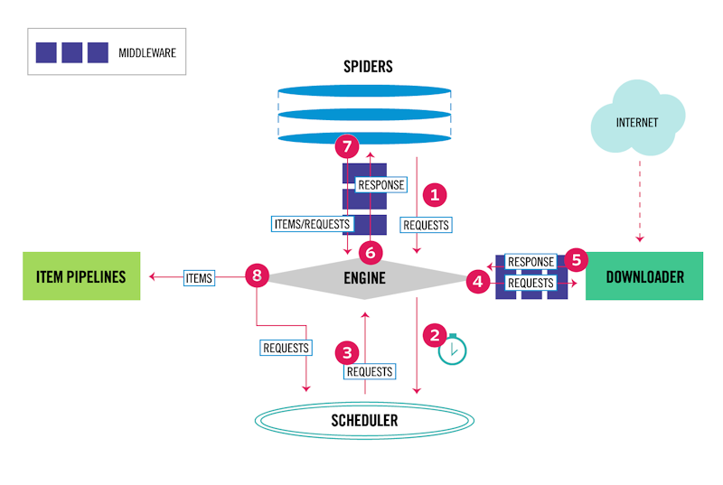

+++
author = "David Gallardo"
title = "Scraping Game Reviews Websites with Scrapy and Selenium"
date = "2021-02-16"
tags = [
    "python",
    "scrapy",
    "selenium",
]
categories = [
    "web scraping",
    "browser automation",
    "games reviews"
]
series = ["Web Scraping"]
aliases = ["migrate-from-jekyl"]
image = "scrapy.png"
+++

## Project Description

Videogames are among my favorite hobbies. I usually buy a couple of games every month so that I always have something to play in my spare time. This means I need to spend some time every day reading games reviews and articles in order to to keep myself up to date. Sure this is a good way of taking my mind off work, but lately I am getting a bit tired of it. Could I automate this procress of going trhough several website in search of game reviews?. Of course yes, and that is why in this post we will create together a web scraper to extract reviews from several websites. To this end, we will make use of the web scraping framework Scrapy. The reason for this, is that it comes with a lot of features out of the box which prevent us from reinventing the wheel each time we decide to scrape a new site.

## Scrapy Architecture

Before diving into web crawling with Scrapy, we will look into its internals, so that we can make a better use of it. Scrapy’s official documentation uses the following diagram to showcase the data flow that takes place under the scenes.



At first glance, you might think this architecture is a little over-engineered, but trust me, it is much simpler that it seems, plus it allows for a ton of customization. Let's give a brief description of the main components of Scrapy:

**Engine**

The Engine orchestrates everything that happens inside Scrapy, passing messages between components following the data flow presented above.

**Downloader**

The Downloader is responsible for downloading webpages. It receives requests from the Engine, sends HTTP requests in order to fetch the webpage and returns the response to the Engine without any further processing. 

**Scheduler**

The Scheduler is responsible for timing the web crawling. It receives requests from the Engine and enqueues them following a given policy.

**Spider**

Spiders are responsibles for parsing web pages. After processing a web page the spider can either return additional requests to be enqueued in the Scheduler or items to be processed by the Item Pipeline.

**Item Pipeline**

The Item pipeline processes the items once they have been extracted by the Spider. Typical uses of the item pipeline are cleaning, validation and storage of the item in a database.

**Middlewares**

MIddlewares are hooks that sit between the Engine and other components . There are two types of middlewares: Spider middlewares and Downloader Middlewares. In this article we will cover Downloader Middlewares, which  process requests coming from the Spider and  responses coming from the Downloader.

## Spiders Life Cycle

Spiders are basically  Python classes that define callback functions to be invoked when responses arrive. In addition, Spiders also define a `start_requests()` method which defines how to start crawling the site.

The life cycle of a Spider is the following:

1. The Engine calls the `start_requests()` method which generates the initial Requests to crawl the site. A Request specifies both the URL and the callback function on the Response.
2. Upon receiving the response, the Engine calls the corresponding method of the Spider. If the callback has been left undefined, the `parse()` method is called.
3. The result of a callback function can either be an Item or a new Request (which in turn specifies another callback function).


## My approach to web scraping

In general, each website requires a different scraping strategy to extract the data we are interested in. However, there are navigation patterns that are widely shared across websites. In this project, we are interested in scraping reviews from video game journalism websites so the scraping strategy will be very similar in all scenarios. The general approach when scraping such websites is to start requesting the page where all the games reviews are listed. Then, we extract the URL of each review so that we can navigate to the review page. When processing a review, we could be interested in extracting further information about the game being reviewed (like the genre, release date publisher, etc). To do so, we need the URL of the game info page, which is usually found in the review page. As a recap, the process followed when scraping a game reviews site is the following:

1. Extract reviews URLs from the listing page.
2. In the review page, extract relevant information about the review (score, conclusion, positive and negative points, etc) as well as the game info URL.
3. In the game info page, extract information about the game being reviewed.

To take into account this shared navigation pattern, every Spider we create (each spider defines the scraping strategy for a website) will inherit from a Base Spider which defines a template for the scraping process. The code of this Base Spider is the following:

``` python3
class BaseSpider(Spider):

    def __init__(self, name=None, **kwargs):
        super(BaseSpider, self).__init__(name=name, **kwargs)

    def get_reviews_url(self, response):
        raise NotImplementedError()

    def request_next_page(self, response):
        raise NotImplementedError()

    def request_review(self, url):
        raise NotImplementedError()

    def parse(self, response):
        urls = self.get_reviews_url(response)
        for url in urls:
            yield self.request_review(url)
        yield self.request_next_page(response)
```

BaseSpider is an abstract class which defines methods required for the crawling process. The only method that has a concrete implementation is the `parse()` method, which is the callback method for requests to the listing page (`start_requests()` and `request_next_page()` must produce requests to the listing page). One example of spider which inherits from BaseClass is the following:

``` python3
class IGNSpider(BaseSpider):
    name = "ign"
    allowed_domains = ["es.ign.com"]

    def start_requests(self):
        return [scrapy_selenium.Request(url="https://es.ign.com/article/review",
                                        middleware_cls=scrapy_selenium.InfiniteScrollIGN)]

    def get_reviews_url(self, response):
        articles = response.xpath("//section[@class='broll wrap']//article")

        all_urls = []
        all_reviews = []
        for article in articles:
            url = article.xpath(".//h3/a/@href").extract_first()
            if "analisis" in url:

                review = GameReview()
                review["url"] = url
                img = article.xpath(".//div[@class='t']/a/img")
                img_srcset = img.xpath("@srcset").extract_first()
                if img_srcset:
                    img_srcset = [el.strip() for el in img_srcset.split(',')]
                    img_url = img_srcset[-1].split(' ')[0]
                else:
                    img_url = img.xpath("@src").extract_first()
                review["img_url"] = img_url
                review["title"] = article.xpath(
                    ".//div[@class='m']/h3/a/text()").extract_first()
                review["description"] = article.xpath(
                    ".//div[@class='m']/p/text()").extract_first()

                all_urls.append(url)
                all_reviews.append(review)

        return all_urls, all_reviews

    def parse_review_1(self, response):
        game_review = self.game_reviews[response.request.url]

        sub_url = urlparse(response.request.url).path.split('/')[1]
        game_review['platforms'] = [platforms_alias[alias]
                                    for alias in platforms_alias if alias in sub_url]

        review_div = response.xpath("//div[@class='review']")
        score = review_div.xpath(
            "./figure//span[@class='side-wrapper side-wrapper hexagon-content']/text()").extract_first()
        if not (game_review['platforms'] and score):
            self.game_reviews.pop(response.request.url)
            return

        game_review['score'] = float(review_div.xpath(
            "./figure//span[@class='side-wrapper side-wrapper hexagon-content']/text()").extract_first()) * 10
        game_review['text'] = response.xpath(
            "//div[@class='details']//div[@class='blurb']/text()").extract_first().strip()
        game_review['best'] = response.xpath(
            "//h3[contains(text(), 'Pros')]/following-sibling::ul/li/text()").extract()
        game_review['worst'] = response.xpath(
            "//h3[contains(text(), 'Contras')]/following-sibling::ul/li/text()").extract()

        summary_section = response.xpath(
            "//section[@class='object-summary embed']")
        game_review['game_name'] = summary_section.xpath(
            ".//h2[@class='object-title']/a/text()").extract_first().strip()
        follow_up_url = summary_section.xpath(
            ".//h2[@class='object-title']/a/@href").extract_first()

        release_date_div = response.xpath(
            "//div[@class='article-modified-date']")
        if not release_date_div:
            release_date_div = response.xpath(
                "//div[@class='article-publish-date']")
        release_date = release_date_div.xpath(
            "./span/text()").extract_first().strip()
        release_date = re.search(r' el (.*?) a las ', release_date).group(1)
        release_date = [el.strip() for el in release_date.split('de')]
        release_date[1] = "{:02d}".format(
            month_name.index(release_date[1].lower()))
        release_date = '-'.join(release_date)
        game_review['release_date'] = release_date

        yield scrapy_selenium.Request(url=follow_up_url,
                                      middleware_cls=scrapy_selenium.DynamicContentMiddleware,
                                      callback=self.parse_review_2,
                                      meta=dict(review_url=response.request.url))

    def parse_review_2(self, response):
        game_review = self.game_reviews[response.meta["review_url"]]
        genres = response.xpath(
            "//dd[@class='keyword-genre']/text()").extract_first()
        genres = [genre.strip() for genre in genres.split('/')]
        game_review["genres"] = genres
        yield game_review

    def request_review(self, url):
        return scrapy_selenium.Request(url=url,
                                       middleware_cls=scrapy_selenium.DynamicContentMiddleware,
                                       callback=self.parse_review_1,)

    def request_next_page(self, response):
        return scrapy_selenium.Request.from_response(response)
```

Notice that to fill all the fields in a review Item we need to make two requests, one to the review page and other to the game info page. The methods `parse_review_1()` and `parse_review_2()` are the callbacks for each request respectively. 


## Scraping dynamic websites with Scrapy and Selenium

Scrapy is an awesome tool that gives us a complete framework for developing web crawlers, covering aspects from fetching web pages (Downloader), to extract data (Spiders), to validate and store such data (Item Pipelines). However, there is one situation where Scrapy lacks, and this is scraping dynamic websites. This kind of websites make use of Javascript to render content at the client side, which means that some parts of the HTML are generated  after the page is loaded or some user interaction has occurred (like pressing a button or scrolling down). This is a problem for vanilla Scrapy because the Downloader does not do any processing on the response, i.e. it does not execute Javascript code. For scraping such websites we need some tool that allows us to programmatically control a web browser. There are plenty of these tools, but for this project we will use Selenium. To combine Scrapy with Selenium we will make use of Downloader Middlewares. 

Similar to what we did in the previous section, every Middleware will inherit from a Base Class that defines the process to follow when intercepting Requests. The code for the base class is the following:

``` python3
class SeleniumMiddleware:
    """Scrapy middleware handling the requests using selenium"""

    def __init__(self, driver_name, driver_arguments):
        """Initialize the selenium webdriver

        Parameters
        ----------
        driver_name: str
            The selenium ``WebDriver`` to use
        driver_arguments: list
            A list of arguments to initialize the driver
        """

        driver_class, driver_options_class = {'firefox': (webdriver.Firefox, webdriver.FirefoxOptions),
                                              'chrome': (webdriver.Chrome, webdriver.ChromeOptions)}[driver_name]

        driver_options = driver_options_class()
        for argument in driver_arguments:
            driver_options.add_argument(argument)
        self.driver = driver_class(
            **{f'{driver_name}_options': driver_options})
        self.first_request = True

    def spider_closed(self):
        """Shutdown the driver when spider is closed"""
        self.driver.quit()

    def _process_request(self, request, spider):
        raise NotImplementedError()

    def _page_source(self,):
        return str.encode(self.driver.page_source)

    def process_request(self, request, spider):
        """Process a request using the selenium driver if applicable"""
        if request.middleware_cls == self.__class__:
            self._process_request(request, spider)
            response_html = self._page_source()
            self.first_request = False
            return HtmlResponse(
                self.driver.current_url,
                body=response_html,
                encoding='utf-8',
                request=request
            )
        return None
```

In the class constructor, we create an instance of the WebDriver class which allows us to programmatically interact with a browser (in our case, we only consider Firefox and Chrome browsers, but there are other options if needed). When creating a custom Middleware, Scrapy requires us to implement the `process_request()` method which will be called by the Engine whenever there is a Request ready to be processed. The output of this method can either be a response or None. If it is the former, the response is automatically processed by the corresponding callback. If it is the latter, the Request is passed to the next Middleware. In our scenario, there will be several Middlewares up and running at the same time (one middleware is necessary for each type of interaction), so we need a way to control which one is going to process the request. To achieve that, we store the target Middleware class in the meta attribute of the Request object, so that each Middleware compares the target class with its own and processes the request if there is a match. The `_process_request()` is an abstract method in which each concrete implementation will define the interaction with the browser via the driver instance. Finally, the `_page_source()` method returns the HTML generated after the interaction.

Next I will present two examples of Middlewares: 1) DynamicContentMiddleware, used to fetch a page whose content dynamically generated after receiving the response; and 2) InfiniteScrollMiddleware, used to navigate a listing page in which the content is generated as the user scrolls down. 

``` python3
class DynamicContentMiddleware(SeleniumMiddleware):
    """Scrapy middleware handling the requests using selenium"""

    def __init__(self, driver_name, driver_arguments, max_delay=10.0, min_delay=7.0):
        super(DynamicContentMiddleware, self).__init__(
            driver_name, driver_arguments)
        self.get_delay = lambda: uniform(max_delay, min_delay)

    def _process_request(self, request, spider):
        """Process a request using the selenium driver if applicable"""
        delay = self.get_delay()
        print(f"Waiting {delay} seconds ...")
        time.sleep(delay)
        self.driver.get(request.url)
```

``` python3
class InfiniteScrollIGN(SeleniumMiddleware):

    def _process_request(self, request, spider):

        if self.first_request:
            self.driver.get(request.url)
            WebDriverWait(self.driver, 10).until(EC.presence_of_all_elements_located((By.XPATH,
                                                                                      "//section[@class='broll wrap']//article//h3/a")))
        else:
            previus_pagenum = int(self.driver.find_elements(
                By.XPATH, "//section[@class='broll wrap']")[-1].get_attribute("data-pagenum"))
            next_pagenum = previus_pagenum + 1
            anchor = self.driver.find_element(
                By.XPATH, "//div[@id='infinitescrollanchor']")
            self.driver.execute_script(
                "arguments[0].scrollIntoView(true)", anchor)
            WebDriverWait(self.driver, 10).until(EC.presence_of_element_located((By.XPATH,
                                                                                 "//section[@class='broll wrap' and @data-pagenum='{}']".format(next_pagenum))))
```

The DynamicContentMiddleware is pretty simple: it just waits for a random period of time (to minimize the server load while scraping) and then, it loads the requested URL in the driver instance. On the flip side, the InfiniteScrollMiddleware is more complex as it needs to simulate a user scrolling down.

## Conclusion

In this post we have created a web scraper to help  us keep up to date with the latests games releases. To this end we used Scrapy and Selenium, and we came up with a way for them to play together nicely. We make a great effort architecting the system so that we can extend it to scrap new websites without having to reinvent the wheel. If you got interested in this project, the source code is available on my Github.